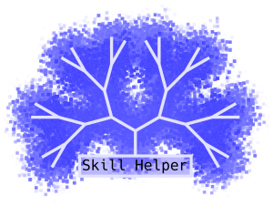

# Skill Helper
Интерактивные заметки для долгосрочного планирования.

Приложение призвано помочь в развитии желаемых навыков, организации рабочего пространства и борьбе с прокрастинацией.

# Установка
## Установка готовой сборки
В [релизах](https://github.com/ZhekaHauska/SkillHelper/releases) можно найти свежие версии програмы для Windows и GNU/Linux. Для установки достаточно распаковать архив с именем `SkillHelper-x.xx-your_os`. В папке `SkillHelper-x.xx-your_os` должен находиться
файл `SkillHelper`, который нужно использовать для запуска программы.

**Замечание для пользователей GNU/Linux:** Для работы программы требуется `libс` версии не ниже **2.31**. Чтобы проверить версию `libc` введите в терминале `ldd --version`.

**Замечание для пользователей Windows:** На данный момент поддерживается только Windows 10.

## Ручная сборка
Ручную сборку рекоменуется проводить с помощью `pyinstaller`. Для этого сначала нужно создать окужение с необходимыми пакетами (полный список зависимостей можно найти в файле [`environment.yml`](https://github.com/ZhekaHauska/SkillHelper/blob/connections/environment.yml)), например, с помощью [Miniconda](https://docs.conda.io/en/latest/miniconda.html): `conda env create -f environment.yml`.

Перед сборкой желательно проверить работоспособность программы, запустив [`main.py`](https://github.com/ZhekaHauska/SkillHelper/blob/connections/main.py) командой: `python main.py`. Далее, нужно отредактировать файл `main.spec`, заменив путь в 7-ой строке на путь к папке с файлом `main.spec`. Осуществить сборку, находясь в директории с `main.spec`, можно командой `pyinstaller main.spec`. Готовая сборка будет находится в папке `dist` этой же директории.

# Особенности
На данный момент, не все поля проверяются на корректность, то есть, если вы введёте букву там, где надо цифру или введёте дату не по формату, то программа может без объяснения причин звершиться. Также не следует оставлять поля ввода(кроме Description) пустыми, это может привести к вылетам. 
