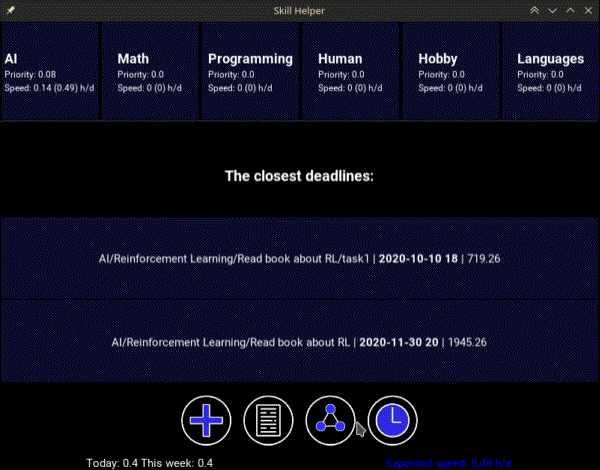

# Skill Helper
Интерактивные заметки для долгосрочного планирования.

Приложение призвано помочь в развитии желаемых навыков, организации рабочего пространства и борьбе с прокрастинацией.

## Особенности
Приложение позволяет создавать записки двух типов: навыки и задания. Оба типа записок имеют счётчик, с помощью которого можно отслеживать время, посвященное выполнению задания или развитию навыка, и редактируемое поле для заметок. Навык является основным типом записей, к которому можно добавлять задания, а к заданиям подзадания и т.д. Время, засчитываемое для задания также засчитывается для всех остальных записок вверх по иерархии.

Перед первым запуском программы рекомендуется сначала на бумаге составить примерный план развития навыков. В данном случае навыками могут быть, например, изучаемые в университете или школе предметы, хобби, проекты. Опишите каждый навык, задайте цель. Организуйте навыки в группы по теме, важности или другому критерию на ваше усмотрение, дайте имена этим группам.

### Навык
Навыки группируются по различным тематикам, имеют название, редактируемое описание, счётчик времени и список заданий. Для каждого навыка вычисляется приоритет на основании количества заданий и их трудности, а также на основании определённых пользователем связей. Навыки с большим приоритетом располагаются выше по списку, что подразумевает определённый порядок распределения времени пользователя. Навыки позволяют сгруппировать задания по общей цели.

### Задание
Задания группируются по навыкам. Задание также может иметь и подзадания, а подзадания ещё задания и так далее. Задания, в отличие от навыков, помимо описания цели и счётчика, имеют также предполгаемое время выполнения и крайний срок сдачи, которые определяются пользователем. На основе этих данных вычисляется средняя скорость выполнения в колличестве часов на день, которую рекомендуется соблюдать, чтобы успеть ко сроку выполнить задание. Чем сильнее отставание от графика, тем выше приоритет задания, который вносит вклад в приоритет соотвествующего навыка. Задание можно пометить как выполненное, тогда оно не будет учитываться при расчёте приоритета и скрыто из панели заданий соответсвующего навыка.   

### Группа
Навыки делятся на группы. Приоритет группы определяется суммой приоритетов всех входящих в неё навыков. Группы просто помогают орагнизовать навыки по теме, важности или по какому-нибудь другому критерию.

### Связи
Связи между навыками модифицируют их приоритет. Так, например, для развития навыков программирования требуется дискретная математика. Данная связь, увеличивает приоритет развития навыка: дискретная математика. Приложение располагает инструментом для описания таких связей между навыками с помощью нодов.

### Временная шкала
С помощью временной шкалы можно одновременно редактировать сроки выполнения всех заданий, оценивать общую нагрузку за различные периоды времени на разных масштабах.

# Установка
## Установка готовой сборки
В [релизах](https://github.com/ZhekaHauska/SkillHelper/releases) можно найти свежие версии програмы для Windows и GNU/Linux. Для установки достаточно распаковать архив с именем `SkillHelper-x.xx-your_os`. В папке `SkillHelper-x.xx-your_os` должен находиться
файл `SkillHelper`, который нужно использовать для запуска программы.

**Замечание для пользователей GNU/Linux:** Для работы программы требуется `libс` версии не ниже **2.31**. Чтобы проверить версию `libc` введите в терминале `ldd --version`.

**Замечание для пользователей Windows:** На данный момент поддерживается только Windows 10.

## Ручная сборка
Ручную сборку рекоменуется проводить с помощью `pyinstaller`. Для этого сначала нужно создать окужение с необходимыми пакетами (полный список зависимостей можно найти в файле [`environment.yml`](https://github.com/ZhekaHauska/SkillHelper/blob/connections/environment.yml)), например, с помощью [Miniconda](https://docs.conda.io/en/latest/miniconda.html): `conda env create -f environment.yml`.

Перед сборкой желательно проверить работоспособность программы, запустив [`main.py`](https://github.com/ZhekaHauska/SkillHelper/blob/connections/main.py) командой: `python main.py`. Далее, нужно отредактировать файл `main.spec`, заменив путь в 7-ой строке на путь к папке с файлом `main.spec`. Осуществить сборку, находясь в директории с `main.spec`, можно командой `pyinstaller main.spec`. Готовая сборка будет находится в папке `dist` этой же директории.
